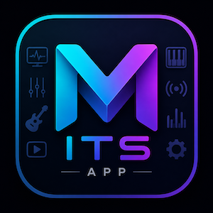

# MITS APP

<p align="center">
  
</p>

**MITS APP** is a lightweight desktop application for **macOS** and **Windows** that provides real-time local system monitoring and seamless integration with **Redragon Stream Station (SS-552)**.

This repository contains **official binary releases only**.

> **The source code is not distributed through this repository.**

---

# Downloads

The latest version is available from the **Releases** section.

➡️ https://github.com/ITSanchez/MITS-App-Releases/releases

Available platforms:

- macOS
- Windows

---

# Features

Current version includes:

- Real-time CPU monitoring
- Memory usage
- Disk usage
- Network traffic
- Uptime
- GPU information
- Local HTTP API
- System Tray (Windows)
- Menu Bar (macOS)
- Automatic startup
- Built-in Plugin Manager
- One-click installation for the **MITS System Monitor** plugin
- English and Spanish interface

---

# Stream Station Integration

MITS APP includes a built-in Plugin Manager for the **Redragon Stream Station (SS-552)**.

Features:

- Install plugin
- Reinstall plugin
- Automatic update detection
- Automatic plugin deployment
- No manual file copying

---

# Privacy

MITS APP works entirely on your local computer.

- No telemetry
- No cloud services
- No user tracking
- No personal data collection

The local API is available only on:

```
127.0.0.1
```

---

# Documentation

Official documentation:

https://musicos.itsanchez.com.ar

---

# Support

If you find a bug or have a feature request, please open an Issue in this repository.

---

# License

This repository contains **official binary releases**.

The application source code is **not included**.

---

---

# MITS APP

<p align="center">
  
</p>

**MITS APP** es una aplicación de escritorio liviana para **macOS** y **Windows** que ofrece monitoreo local del sistema en tiempo real e integración con **Redragon Stream Station (SS-552)**.

Este repositorio contiene **únicamente las versiones oficiales compiladas**.

> **El código fuente no se distribuye desde este repositorio.**

---

# Descargas

La versión más reciente está disponible en la sección **Releases**.

➡️ https://github.com/ITSanchez/MITS-App-Releases/releases

Plataformas disponibles:

- macOS
- Windows

---

# Características

La versión actual incluye:

- Monitoreo de CPU en tiempo real
- Uso de memoria
- Uso de discos
- Tráfico de red
- Tiempo de actividad (Uptime)
- Información de GPU
- API HTTP local
- System Tray en Windows
- Menu Bar en macOS
- Inicio automático
- Administrador de plugins integrado
- Instalación con un clic del plugin **MITS System Monitor**
- Interfaz en Español e Inglés

---

# Integración con Stream Station

MITS APP incorpora un administrador para el plugin **MITS System Monitor** de **Redragon Stream Station (SS-552)**.

Permite:

- Instalar el plugin
- Reinstalar el plugin
- Detectar actualizaciones
- Copiar automáticamente el plugin
- Evitar instalaciones manuales

---

# Privacidad

MITS APP funciona completamente de manera local.

- Sin telemetría
- Sin servicios en la nube
- Sin seguimiento del usuario
- Sin recopilación de información personal

La API local solo escucha en:

```
127.0.0.1
```

---

# Documentación

Documentación oficial:

https://musicos.itsanchez.com.ar

---

# Soporte

Si encontrás un error o querés proponer una mejora, podés abrir un **Issue** en este repositorio.

---

# Licencia

Este repositorio distribuye únicamente las versiones oficiales compiladas de MITS APP.

El código fuente **no forma parte** de este repositorio.
